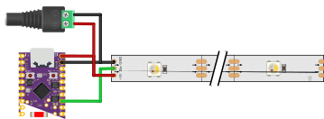

# Wiring Guide

## Minimum reliable wiring

Important: ESP GND and LED PSU GND must be connected together.

## Recommended additions

- Logic level shifter (3.3V -> 5V)
- 1000µF capacitor across LED `+5V/GND`
- Power injection for long strips

## Power sizing

Approximate worst case:

`Current (A) = LED count × 0.06`

Use at least 1.5x margin.

Examples:
- 30 LEDs: ~1.8A -> use 3A+
- 60 LEDs: ~3.6A -> use 5A+
- 150 LEDs: ~9A -> use 12-15A+

## Bring-up checklist

- Data wire on DIN, not DOUT
- Common ground confirmed
- Correct LED type and count in config
- No exposed conductors near water
